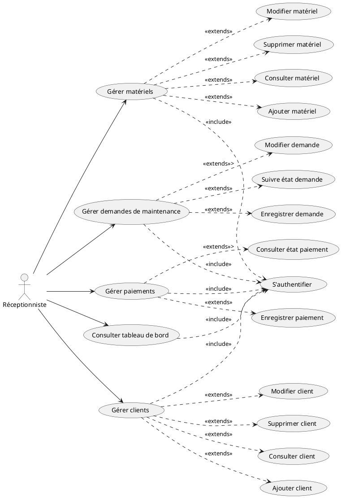
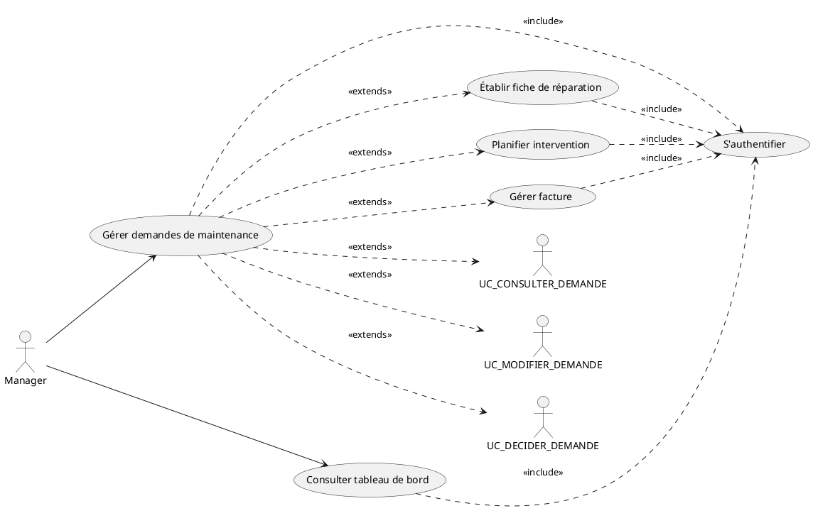
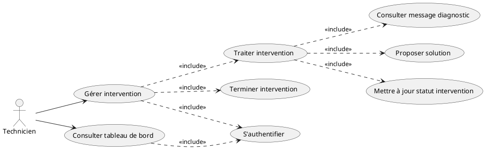
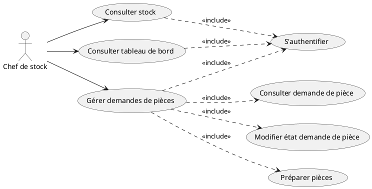
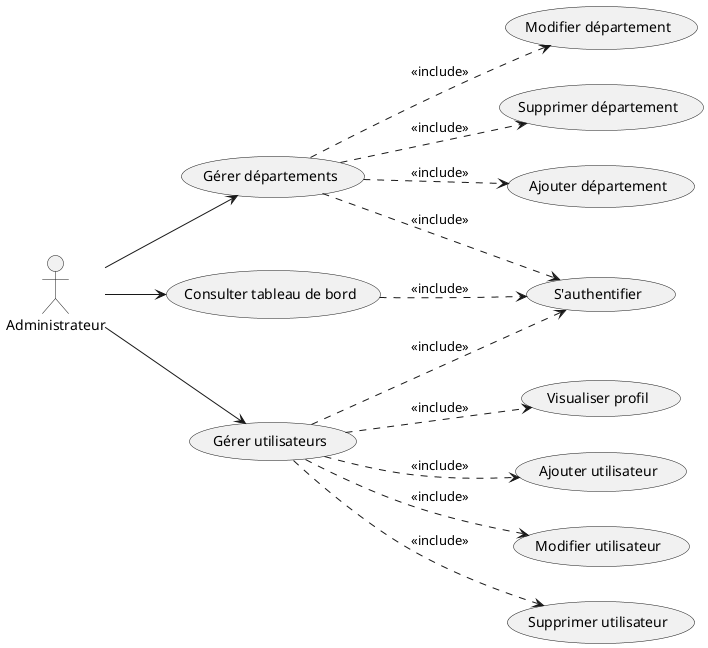
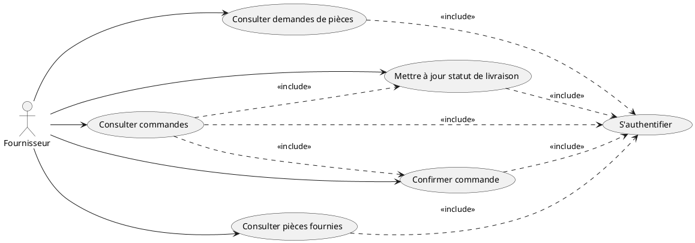
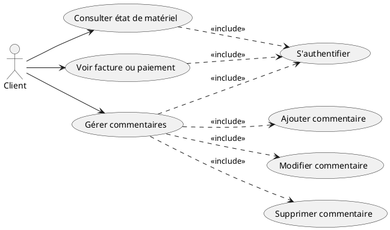
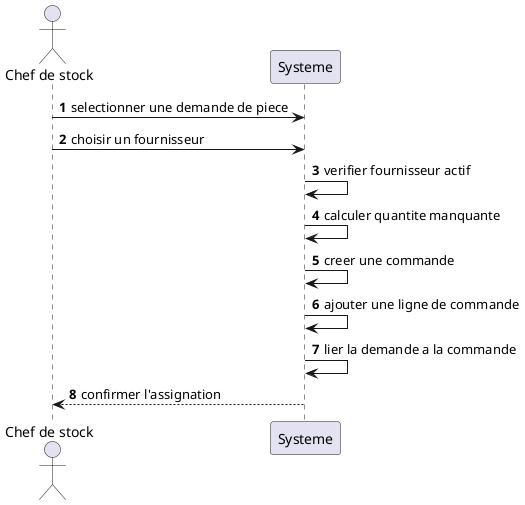
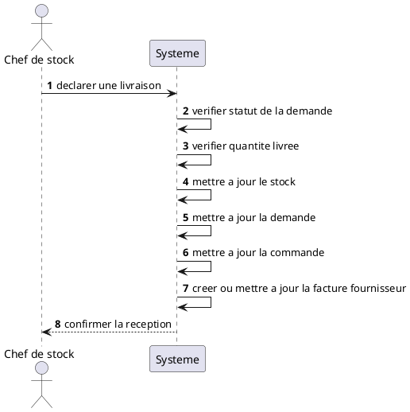
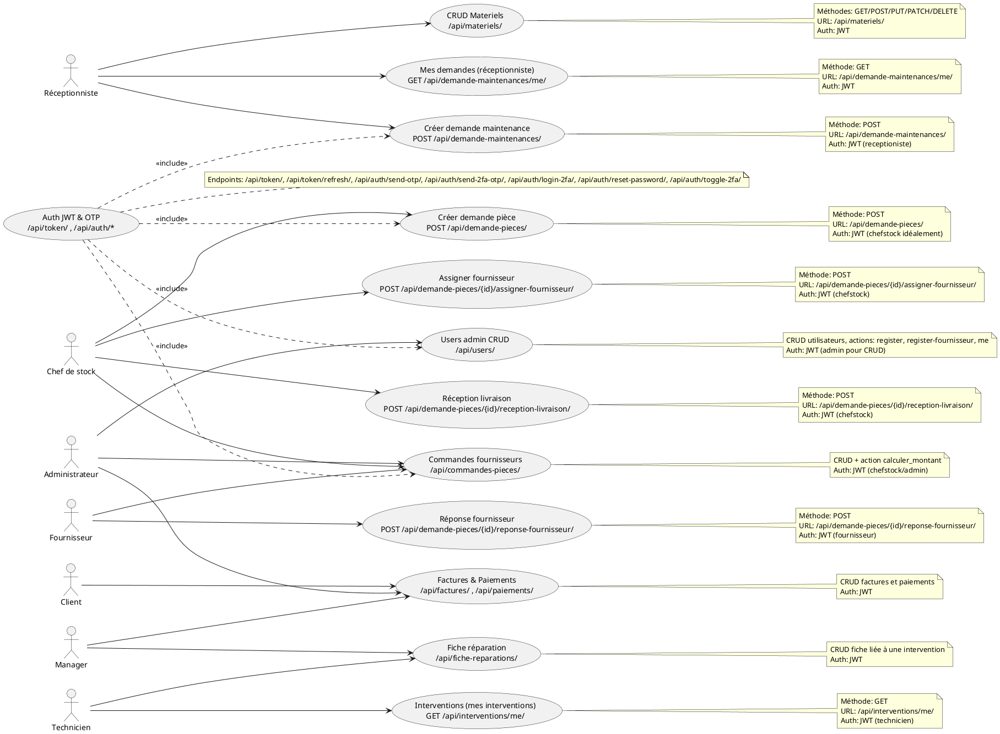

# Diagrammes de cas d'utilisation raffinés par acteur

Les diagrammes ci-dessous reprennent le diagramme global sous une forme raffinée par acteur, dans l'esprit de l'exemple fourni.

## 1) Réceptionniste

## 2) Manager

## 3) Technicien

## 4) Chef de stock

## 5) Administrateur

## 6) Fournisseur

## 7) Client

Si tu veux, je peux aussi te les transformer en version image ou en version Mermaid/Word plus propre pour un mémoire ou un rapport.

## 8) Sequence - Assignation fournisseur

## 9) Sequence - Reception livraison

## 10) Diagramme annoté - Endpoints par rôle

